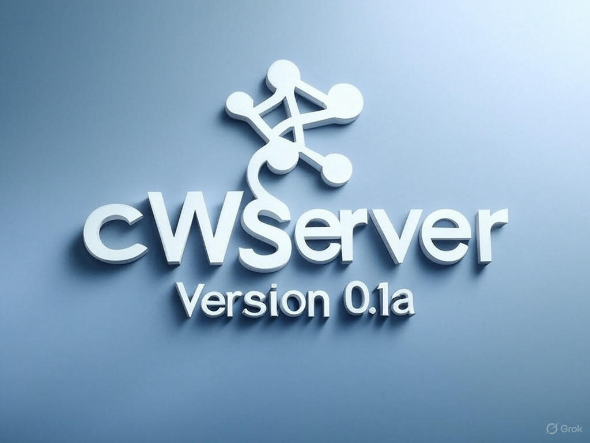

# cWServer - Легкий, багатопотоковий веб-сервер

 

**cWServer** - це **легкий та багатопотоковий веб-сервер, написаний на мові програмування C з використанням стандартних бібліотек POSIX**. Він розроблений для ефективного обслуговування статичного контенту та має багатопотокову архітектуру для обробки одночасних з'єднань.  Сервер призначений в першу чергу для освітніх цілей, демонстрації основних принципів роботи веб-серверів, але може бути використаний і для простих задач обслуговування статичних веб-сайтів.  Простота коду та використання стандартних бібліотек роблять його легким для розуміння, модифікації та перенесення на різні платформи.

## Основні можливості

- **Обслуговування статичних файлів:** cWServer ефективно обслуговує статичні файли, такі як HTML, CSS, JavaScript, зображення, відео та аудіо.
- **Багатопотокова архітектура:** Сервер використовує POSIX потоки (`pthreads`) для обробки кожного вхідного з'єднання в окремому потоці, що забезпечує хорошу продуктивність при великій кількості одночасних запитів.
- **Підтримка часткових запитів (Content-Range):** Сервер підтримує обробку HTTP-заголовків `Content-Range`, дозволяючи клієнтам отримувати файли частинами, що корисно для великих файлів або перерваних з'єднань.
- **Кешування відключено (Cache-Control: no-cache):** За замовчуванням сервер відключає кешування на стороні клієнта, щоб забезпечити віддачу найновішого контенту.
- **Перегляд вмісту директорій:** Якщо в запиті вказана директорія, а не конкретний файл, сервер генерує HTML-сторінку зі списком файлів у цій директорії.
- **Стилізація списку директорій:** Можливість вибору стилю іконок для списку директорій:
  - **text:** Текстові іконки `[D]`, `[TXT]`, `[IMG]` і т.д.
  - **emoji:** Іконки emoji `[📂]`, `[📝]`, `[🖼️]` і т.д.
  - **none:** Без іконок.
- **Режим Protected Directory View (раніше псевдо-FTP):** Режим захищеного перегляду директорій з паролем. Дозволяє обмежити доступ до певних директорій за паролем, використовуючи префікс шляху на основі пароля.
- **Режим демона:** Можливість запуску сервера у фоновому режимі як демон.
- **Детальне логування:** Сервер веде лог доступу та помилок у стандартний вивід помилок (stderr).
- **Обробка URL-encoded запитів:** Сервер коректно обробляє URL-encoded символи у запитах.
- **Обробка index.html:** При запиті директорії сервер спочатку шукає файл `index.html` у цій директорії і, якщо знаходить, обслуговує його. Якщо `index.html` відсутній, сервер повертає список файлів директорії (якщо не увімкнено Protected Directory View).

## Архітектура

Поточна збірка сервера оптимізована для **архітектури MIPS (74kc, mips16, mdsp, EB)**. Makefile містить налаштування компілятора та лінкера, специфічні для цієї архітектури, включаючи:

- `-march=74kc -mips16 -mdsp`: Опції GCC для оптимізації під архітектуру MIPS 74kc з використанням інструкцій MIPS16 та DSP.
- `-EB`: Вказівка на big-endian порядок байтів (якщо потрібно).
- Специфічні опції лінкування та strip для зменшення розміру виконуваного файлу.

**Збірка для інших архітектур:**

Для збірки на інших архітектурах вам може знадобитися змінити значення змінних `CFLAGS` та `LDFLAGS` у `Makefile`. Зокрема, вам потрібно буде скоригувати:

- `-march=...`: Вказати цільову архітектуру для вашого процесора.
- `-mips16 -mdsp -EB`: Видалити або змінити ці опції, якщо вони не підтримуються вашою архітектурою або не потрібні.
- `--sysroot=... -I...`: Перевірити та оновити шляхи до системних include та lib директорій, якщо вони відрізняються у вашій системі.

**Важливо:** Користувачі мають право змінювати та розповсюджувати код сервера відповідно до умов ліцензії GPLv2 або пізнішої.

## Як почати

### Компіляція

Для компіляції сервера вам знадобиться компілятор C (наприклад, GCC) та `make`.

1. Переконайтеся, що у вас встановлено необхідні інструменти розробки (GCC, make, та інші необхідні бібліотеки).
2. Збережіть файл `cwserver_v0.1a.c` та `Makefile` в одній директорії.
3. Відкрийте термінал у цій директорії.
4. Виконайте команду `make`:

    ```bash
    make
    ```

    Це створить виконуваний файл `cwserver`.

### Запуск

Для запуску сервера використовуйте наступну команду:

```bash
./cwserver [опції]

Опції командного рядка:
-p port: Вказує порт для прослуховування (за замовчуванням: 8080).
-w web_root: Вказує кореневу директорію веб-сервера (за замовчуванням: поточна директорія . ).
-d: Запускає сервер в режимі демона (у фоновому режимі).
-h: Показує довідкове повідомлення з описом опцій.
-V: Показує інформацію про версію сервера.
-verbose: Вмикає режим детального виводу (для відлагодження).
-i icon_style: Вказує стиль іконок для списку директорій (за замовчуванням: text). Можливі значення: text, emoji, none.
-pdir password: Вмикає режим Protected Directory View з паролем password.
```
## Приклади запуску

- **Запуск сервера на порту 8089, використовуючи поточну директорію як web root, зі стилем іконок emoji:**

    ```bash
    ./cwserver -p 8089 -w . -i emoji
    ```

- **Запуск сервера в режимі демона на порту 80, використовуючи `/var/www` як web root:**

    ```bash
    ./cwserver -p 80 -w /var/www -d
    ```

- **Запуск сервера з увімкненим режимом Protected Directory View та паролем `secret`:**

    ```bash
    ./cwserver -p 8080 -pdir secret
    ```

**Важливо:** При використанні режиму Protected Directory View, запити до директорій, захищених паролем, повинні починатися з префікса шляху, що включає пароль. Наприклад, якщо пароль "secret", і ви хочете отримати доступ до директорії `/ftp/private`, URL буде виглядати як `/secret/ftp/private`.

## Ліцензія

cWServer розповсюджується під ліцензією **GPLv2 або пізнішою**.

Цей проект ліцензовано на умовах **GNU General Public License version 2** або будь-якої пізнішої версії (GPLv2+).

Ви маєте повну свободу:

- Використовувати програмне забезпечення для будь-яких цілей.
- Вивчати, як працює програма, і адаптувати її до своїх потреб.
- Розповсюджувати копії програмного забезпечення.
- Покращувати програму та публікувати свої покращення.

Повний текст ліцензії доступний за посиланням: [http://www.gnu.org/licenses/gpl.html](http://www.gnu.org/licenses/gpl.html).

## Автор

**Ivan Svarkovsky** - [https://github.com/Svarkovsky](https://github.com/Svarkovsky)

Зроблено з ❤️ для людей.


